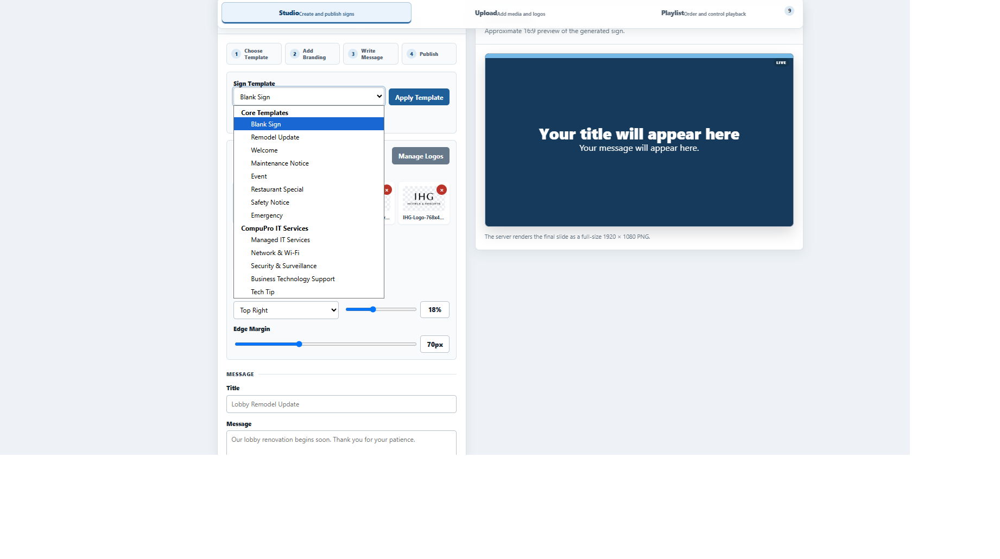
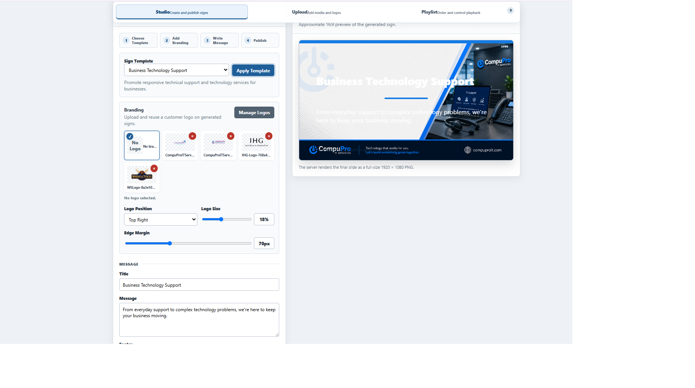
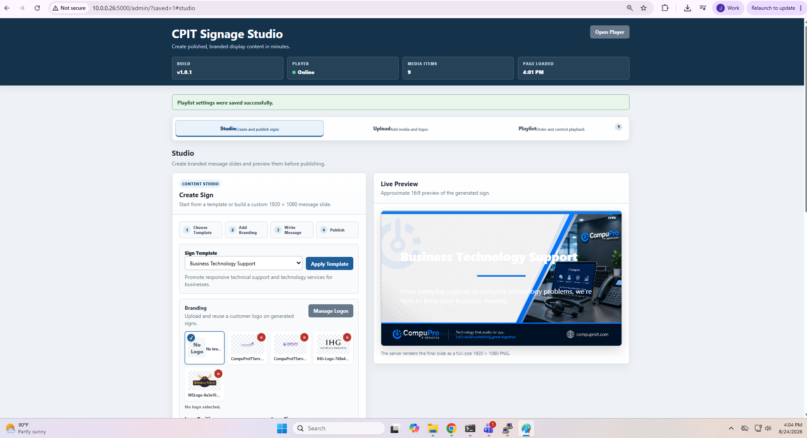

# CPIT Signage Studio

**A lightweight, self-hosted digital signage platform for Linux.**

CPIT Signage Studio turns a Debian-based computer into a complete digital signage appliance with a built-in browser-based Studio, media management, playlists, kiosk playback, and installable Template Packs.

Create and manage signage from another computer on the network while the player continues displaying content locally.

No cloud signage service is required.

---

## Screenshots

### Browser-Based Sign Studio

CPIT Signage Studio provides a browser-based workspace for creating and publishing digital signage. Start with a blank sign, use a built-in template, or install an optional Template Pack.



### Templates, Branding, and Live Preview

Select a template, add reusable branding, enter your message, and preview the finished sign before publishing it to the playlist.



### Complete Administration Interface

Studio, media uploads, Template Packs, logos, playlist management, player status, and playback controls are managed from the same browser-based interface.



---

## Example Signage

CPIT Signage Studio can use custom Template Packs to produce signage designed around a specific business or brand.

### Managed IT Services


### Network & Wi-Fi


### Business Technology Support


The examples above were produced using a custom CompuPro IT Services Template Pack. Template Packs can provide backgrounds, layouts, and starting content tailored to an industry or individual organization.

---

## Features

### Studio

- Browser-based sign creation
- Live 16:9 preview
- Server-rendered 1920 × 1080 PNG output
- Reusable backgrounds
- Logo library
- Reusable sign templates
- Installable Template Packs
- Custom branded Template Pack support

### Content Management

- Browser-based administration
- Multi-image uploads
- Separate playlist and background libraries
- Drag-and-drop playlist ordering
- Per-item display duration
- Enable/disable controls
- Media deletion
- Automatic player updates

### Player

- Chromium kiosk playback
- Local media storage
- Offline playback
- Automatic startup after boot
- Automatic user login configuration
- Local playlist operation without a cloud service

### Deployment and Maintenance

- Debian 13
- Automated installation
- Upgrade tools
- GDM3 and LightDM detection
- Health-check diagnostics
- systemd application service
- SSH remote administration
- Compatible with VPN solutions such as Tailscale
- Git-based development and version control

---

## How It Works

CPIT Signage Studio is designed so that the signage computer performs both playback and content management.

```text
Administrator Browser
        |
        | Local network, VPN, or SSH tunnel
        v
CPIT Signage Studio
        |
        +---- Browser-based Studio
        |
        +---- Media and Template Pack management
        |
        +---- SQLite media and playlist database
        |
        +---- Local media storage
        |
        +---- Sign generator
        |
        v
Chromium Kiosk Player
        |
        v
Television / Display
```

Content is stored locally on the signage player. Once content has been uploaded and configured, normal playback does not require a cloud signage service.

---

## Template Packs

Template Packs allow optional collections of backgrounds and preconfigured sign templates to be installed without modifying the core application.

A Template Pack can be designed for an industry, use case, or individual business.

Examples include:

- Cigar lounges
- Restaurants
- Hotels
- Retail
- Offices
- Events
- Custom customer-branded packs

Template Packs are distributed separately from the base application and can be installed or removed through the web administration interface.

This allows the same CPIT Signage Studio installation to be customized for very different environments.

---

## Requirements

The current deployment platform is:

- Debian 13
- Chromium
- Python 3
- Network connection for remote administration
- HDMI or other supported display output

A dedicated or repurposed small-form-factor computer can be used as the signage player.

Development and testing have included QSR DX3000 and Bematech LC8810 hardware as well as virtualized Debian 13 test systems.

---

## Installation

The easiest way to install CPIT Signage Studio is to use a packaged release rather than downloading the development source tree.

### 1. Download a Release

Open the repository's **[Releases](https://github.com/jimmysmith-dot/cpit-signage/releases)** page and download the latest packaged release:


```text
cpit-signage-studio-VERSION.zip
```

Extract the ZIP on a clean Debian 13 system.

### 2. Open a Terminal

Change into the extracted directory:

```bash
cd cpit-signage-studio-VERSION
```

### 3. Run the Installer

Make the installer executable:

```bash
chmod +x install.sh
```

Run:

```bash
sudo ./install.sh
```

Follow the installer prompts.

### 4. Reboot

After installation:

```bash
sudo reboot
```

A correctly configured signage player should automatically:

```text
Boot Debian
    ↓
Log in
    ↓
Start CPIT Signage Studio
    ↓
Launch Chromium
    ↓
Display the signage player
```

No user interaction should normally be required after startup.

---

## Administration

The player interface is available locally at:

```text
http://127.0.0.1:5000/
```

The administration interface is:

```text
http://127.0.0.1:5000/admin/
```

When the signage computer is accessible from another computer on the same trusted network, replace `127.0.0.1` with the signage player's IP address.

For example:

```text
http://PLAYER-IP:5000/admin/
```

---

## Remote Administration with SSH

An SSH tunnel can also be used when direct access to port 5000 is unavailable.

From Windows PowerShell:

```powershell
ssh -N -L 5000:127.0.0.1:5000 user@PLAYER-IP
```

Then open:

```text
http://127.0.0.1:5000/admin/
```

VPN solutions such as Tailscale can also be used to provide remote access to installations behind third-party networks or firewalls.

---

## Health Check

CPIT Signage Studio includes a health-check utility for validating an installation.

From the application directory:

```bash
cd /opt/cpit-signage
./scripts/health-check.sh
```

The health check validates important components of the signage installation and can help identify deployment or configuration problems.

---

## Service Management

Check the application service:

```bash
sudo systemctl status cpit-player
```

Restart it:

```bash
sudo systemctl restart cpit-player
```

View recent logs:

```bash
sudo journalctl -u cpit-player -n 100 --no-pager
```

---

## Repository Layout

```text
/opt/cpit-signage
├── app/            Application and web interface
├── config/         Application configuration and database
├── deployment/     systemd deployment files
├── docs/           Project documentation and screenshots
├── media/          Local signage media
├── packs/          Template Pack development
├── scripts/        Deployment, kiosk, release, and diagnostic tools
├── static/         Static application resources
├── install.sh      Automated installer
├── requirements.txt
├── VERSION
└── README.md
```

---

## Documentation

Additional documentation is available in the `docs/` directory:

- `INSTALL.md`
- `ARCHITECTURE.md`
- `API.md`
- `OPERATIONS.md`
- `DEVELOPMENT.md`
- `ROADMAP.md`
- `CHANGELOG.md`
- `RELEASE_CHECKLIST.md`
- `SECURITY.md`

---

## Project Status

CPIT Signage Studio is under active development.

The core application has been successfully installed and tested from clean Debian 13 environments, including automated installation, kiosk startup, remote administration, sign creation, playlist management, health diagnostics, and optional Template Pack installation.

The project is currently suitable for testing and controlled deployments.

See the repository's **Releases** page for the latest packaged version.

---

## Help Test CPIT Signage Studio

Outside testing is welcome.

We are particularly interested in people willing to install CPIT Signage Studio on a clean Debian 13 system and provide feedback about:

- Installation
- Hardware compatibility
- Automatic startup
- Browser administration
- Studio usability
- Template Packs
- Documentation
- Long-term player reliability

Development experience is not required.

Feedback from users with limited Linux or GitHub experience is especially useful because one of the project's goals is straightforward deployment and administration.

If you encounter a problem, please open a GitHub Issue and include the hardware being used, Debian version, and relevant health-check output.

---

## Technology

CPIT Signage Studio currently uses:

- Python
- Flask
- SQLite
- Pillow
- HTML / CSS / JavaScript
- Chromium
- systemd
- Debian Linux

---

## License

See the `LICENSE` file for licensing information.

---

**CPIT Signage Studio** is developed by **CompuPro IT Services**.
